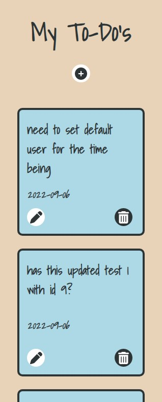
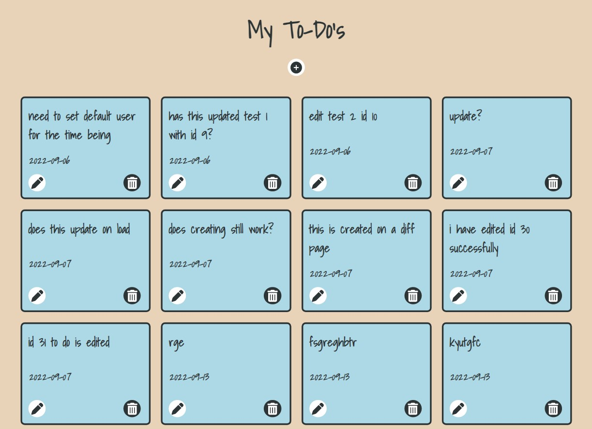

# To-Do List Full-Stack project

This repository holds the front-end to this app and is created using React. To view the Spring back-end click [here](https://github.com/kav97/todo).

## Quickstart:

1. Install the dependencies with `npm install`

2. Run the application with `npm start`

 

## About the project 💭

- As part of the final project in the _nology course, we were tasked in creating a full-stack project of our choice that incorporates everything we have learned in the past 12 weeks. The application had to include both a front-end and back-end. 

- This application allows the user to write down and keep track of any task/ goal all in one place so that they don't forget anything important

- Following a CRUD specification. The user can Create, Read, Update and Delete any to-do item as they please. These changes will be tracked by my API and stored in MySQL database.

- Webpage routing allows access to the create/ update to-do pages. The title will route back to the home-page '/'.

- A mobile-first design approach has been taken into consideration from device widths: 325px (small mobile) to 1440px (large desktop).

 

## Project View 📱

 

| Mobile View | Desktop View |
|:---:|:---:|
|| |

 

## Future improvements 🌟

- Eventually I would like to add a filtering system to a nav bar that sorts the to-do cards displayed by: date created and priority (red: highest, amber: second and green: lowest).

- Host the spring back-end using GCP so that anyone can access and use the live site.

- Log-in page (authentication required) that gives users access to their own list.

- Following the previous point, the GET request will then need to be changed to the "created-by" GET endpoint.